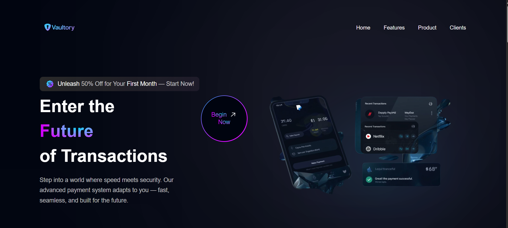

# 🚀 Futuristic Payment Landing Page



A modern, high-performance landing page built with **React**, **Vite**, and **Tailwind CSS**, featuring a futuristic design, animated hero section, and responsive UI components. Perfect for fintech, SaaS, or any cutting-edge digital product.

---

## ✨ Features

- 💳 Hero section with animated futuristic payment UI
- 🌌 Dark theme with neon blue and cyan gradients
- 🌀 Smooth hover animations and subtle 3D depth
- 📱 Fully responsive across all devices
- ⚡ Built using Vite for fast development and build times
- 🎨 Styled with Tailwind CSS and custom gradients

---

## 🛠️ Tech Stack

- [React](https://reactjs.org/)
- [Vite](https://vitejs.dev/)
- [Tailwind CSS](https://tailwindcss.com/)

---

## 📁 Folder Structure

landing-page/
├── public/
│ └── index.html
├── src/
│ ├── assets/
│ │ └── bank-landing-page.png # <-- Your preview image
│ ├── components/
│ ├── style.js
│ └── main.jsx
├── tailwind.config.js
├── vite.config.js
├── package.json
└── README.md


---

## 🚀 Getting Started

### Prerequisites
- Node.js (v16 or later)
- npm or yarn

### Installation

```bash
git clone https://github.com/yourusername/landing-page.git
cd landing-page
npm install

Start the Development Server
npm run dev
Visit http://localhost:5173 to view the project in your browser.

🔨 Build for Production
npm run build
The output will be in the dist/ folder, ready to deploy.

🤝 Contributing
Contributions are welcome!
Feel free to fork the repository and submit a pull request.

📄 License
This project is licensed under the MIT License.

📬 Contact
For feedback or collaboration:

📧 Email: krishna.sahu.work@gmail.com


